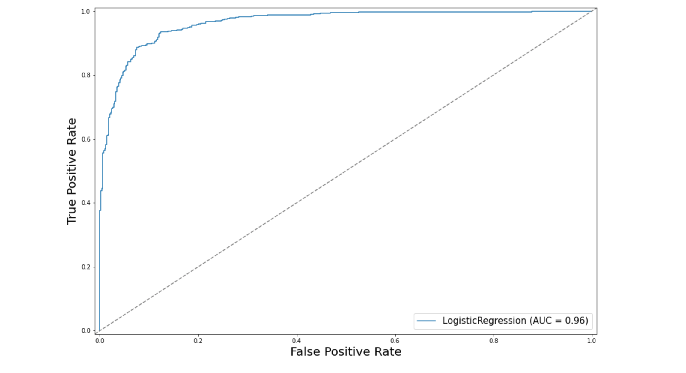

# Classifying Stack Overflow posts using Machine Learning and Natural Language Processing

## Description

The goal of this tasks is to train a machine learning classifier to distinguish between questions tagged *python* and *java* using the text of the question. The resulting classifier represents a first step towards a system that can automatically categorize new incoming posts. The data cosists of random sample of 1000 posts tagged python and 1000 posts tagged java.

The final model trained based on the sample data achieved 90% accuracy. For more details on the model, see the Jupyter Notebook NLP+classification.ipynb.

## Natural Laguage Processing

To obtain the tokens from the corpus, the following custom functions were used to lemmentise the tokes, stem the tokens, removing stopwords and removing punctutation.

```python
lemmatizer = WordNetLemmatizer()
ps = PorterStemmer() 
en_stopwords= stopwords.words('english')

def get_wordnet_pos(token):
    """Helper function: map POS tag to first character lemmatize() accepts
    Taken from: https://www.machinelearningplus.com/nlp/lemmatization-examples-python/
    """
    tag = nltk.pos_tag([token])[0][1][0].upper() #extract the information
    tag_dict = {"J": wordnet.ADJ, #map
                "N": wordnet.NOUN,
                "V": wordnet.VERB,
                "R": wordnet.ADV}
    return tag_dict.get(tag, wordnet.NOUN) #guess noun if unknown


def processing_pipeline(text):
    '''takes a sentence and returns a lowercased, lemmatized, and stemmed list of tokens'''
    tokens=nltk.word_tokenize(text)
    lemmatized_tokens=[lemmatizer.lemmatize(token, get_wordnet_pos(token)) for token in tokens]
    stemmed_tokens =[ps.stem(token) for token in lemmatized_tokens]
    processed_tokens = [token for token in stemmed_tokens if token not in en_stopwords] #removing stopwords/common words
    processed_tokens = [token for token in processed_tokens if token not in string.punctuation] #removing punctiuation
    return processed_tokens
```

## Training a Logistic Regression model

The response variable is the indicator of whether a post is a python post: 1 - python, 0 - java

```python
X_train, X_test, y_train, y_test = train_test_split(DTM, y, test_size=.5, random_state=42)

reg = LogisticRegression(penalty='l1',solver='saga',C=10)
reg.fit(X_train, y_train)
y_pred = reg.predict_proba(X_test)[:,1]
```

## Results

Confusion Matrix | Predicted Positive | Predicted Negative 
--- | --- | --- 
Actual Positive | 449 | 44 
Actual Negative | 55 | 452 

The model performs much better than the baseline accuracy of 50% with an accuracy score of approximately 90% which means that the model classifies 90% of the posts correctly. The remaining 10% are false positives and false negative - see the confusion matrix above. Moreover, the AUC measure is quite high as well with the value of 0.965 which tells us that a randomly selected python post has a much higher probability of being a python post with the logistic regression model than a randomly selected java post.



## Top 10 suggestive features of Python and Java

Ranking | Python | Java
--- | --- | --- 
1 | python | int
2 | def | void
3 | self | kindli
4 | modul | netbean
5 | print | eclips
6 | django | privat
7 | function | android
8 | re | public
9 | model | new
10 | element | java


## Author
Ema Vargova

